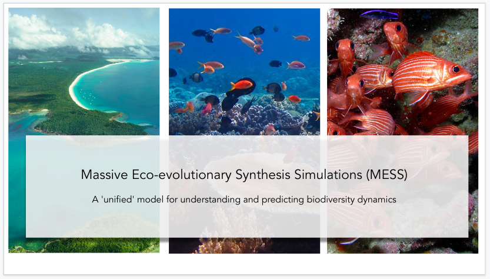

# The Full MESS + Likelihood-free Inference

Click the link below to check out the video!

## Resources

- [A unified model of species abundance, genetic diversity, and functional diversity reveals the mechanisms structuring ecological communities](https://onlinelibrary.wiley.com/doi/full/10.1111/1755-0998.13514)
    - Presents the MESS model
    - Finds the machine learning approach has decent accuracy 
- [another article](url)
    - foo
    - bar
